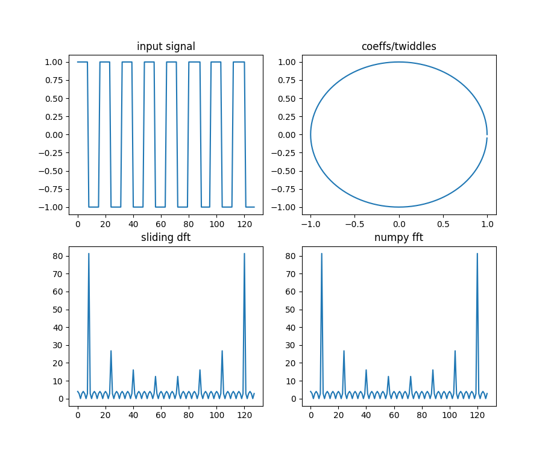

# FFT on an FPGA

having a go at some DSP on an FPGA. I'm basing the design on this paper:

http://www.comm.toronto.edu/~dimitris/ece431/slidingdft.pdf

This is a sliding discrete Fourier transform. It requires two real adds and one complex multiply per frequency bin. The transform is run for every new sample taken.

# Makefile

* make show-sdft - use yosys show to see how the design is inferred
* make debug-sdft - use iverilog, vvp and gtkwave to show the results of the testbench
* make - build everything
* make prog - program the icestick

# Done

* Read the resources
* Implement HDL twiddle factor ROM
* Implement an [SDFT in Python](python/sdft.py) using the same pattern
* Why doesn't makefile build from scratch? - missing a file
* Why do freq bin regs overflow almost immediately in the testbench? scaling
* How to do scaling - the twiddle factors are scaled to fill the hole register so things overflow quickly, divide by 127
* Why doesn't pnr work? - it does, but the module wasn't being used so yosys was removing it

# Todo

* make the python tools parse test/localparams.vh 

# Resources

* great video that explains what the Fourier transform is: https://www.youtube.com/watch?v=spUNpyF58BY
* paper on implementing an FFT on an FPGA http://web.mit.edu/6.111/www/f2017/handouts/FFTtutorial121102.pdf
* using Python to implement FFT: https://jakevdp.github.io/blog/2013/08/28/understanding-the-fft/
* sliding FFT https://www.dsprelated.com/showarticle/776.php
* stackoverflow answer about sdft: https://stackoverflow.com/questions/6663222/doing-fft-in-realtime
* paper on SDFT: http://www.comm.toronto.edu/~dimitris/ece431/slidingdft.pdf
